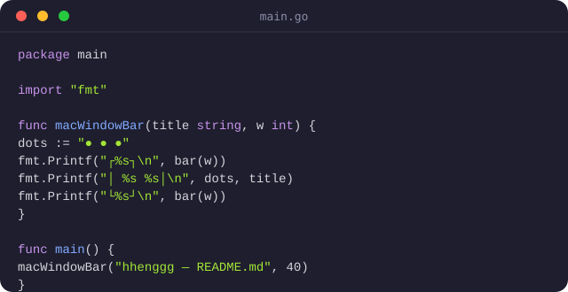

<h1 align="center">Hi, I'm Heng 👋</h1>

  

    Software engineer building cool things with cool people in a cool city using cool tech, solving cooler problems one commit at a time.
  

  

    
  

  ---

  ### About Me

  - 💼 Working at a startup building software locally.
  - 🛠️ Backend in **Go**, frontend in **Nuxt.js**, with solid time in database design and query optimization.
  - 🌱 Always adding to the stack — open to new tools when they solve a real problem.
  - 🏋️ Off the keyboard, you'll find me at the gym — same mindset as debugging: show up, do the reps, track progress.
  - 📍 Based in Cambodia, building for Cambodia.
  - 📫 Reach me here on GitHub — **[@hhenggg](https://github.com/hhenggg)**.

  ---

  ### Right Now

  - 🔭 Currently building product for the local market at a startup
  - 🏗️ Sharpening Go on the backend, Nuxt on the front
  - 🎯 2026 goal: ship consistently, lift consistently

  ---

  ### Tech Stack

  

    
    
    
    
    
    
    
    
  

  ---

  ### GitHub Stats

  

    
  

  ---

  ### Just for Fun

  

    
  

  ---

  ### Outside of Code

  🏋️ Gym &nbsp;•&nbsp; 📚 Always learning something new &nbsp;•&nbsp; ☕ Powered by coffee and consistency

  > "Discipline is choosing between what you want now and what you want most." — same rule applies to reps and to refactors.

  ---

